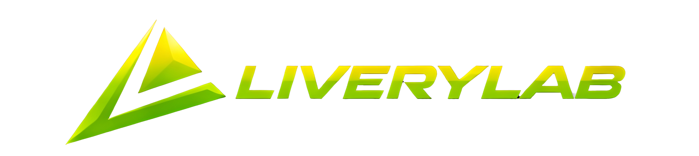

<p align="center">
	
</p>

<p align="center">
	<strong>Free browser-based iRacing paint editor</strong><br>
	Official iRacing templates, layered painting tools, and fast PNG/TGA export in one clean workflow.
</p>

<p align="center">
	<a href="https://hman0994.github.io/liverylab">Open Livery Lab</a>
</p>

<p align="center">
	
	
	
</p>

## Paint Faster

Livery Lab gets you from template to export quickly: open the app, choose a car, paint, and drop the result into iRacing.

Current release: **v0.1.1**

## Why It Stands Out

- **164 preloaded cars** using PSD templates sourced directly from iRacing
- **Layered editing** with brush, eraser, fill, shapes, gradients, text, and decals
- **Fast startup picker** with search, category chips, and recent cars
- **iRacing-ready export** in `PNG` or `32-bit TGA` at `1024x1024` or `2048x2048`
- **Project save/load** with JSON so you can come back later

## Quick Start

1. Open [Livery Lab](https://hman0994.github.io/liverylab).
2. Choose a bundled car, upload your own PSD, or start blank.
3. Paint with the toolbar tools.
4. Export and place the file in the folder shown by the app.

## Built-In Car Library

Livery Lab includes a bundled car library of preloaded PSD templates sourced directly from iRacing. The library is backed by [templates/cars.json](templates/cars.json), which maps each template to a display name, category, default dimensions, and iRacing folder hint.

- Starts with the car picker first
- Uses official iRacing template files already packaged with the app
- Supports search, category filters, and recent cars
- Shows the correct export folder hint for the selected car

If you open [index.html](index.html) directly with `file://`, some browsers block bundled-template loading. Running the app from the live site or any local HTTP server avoids that issue.

## Exporting To iRacing

Livery Lab shows the target folder for the selected car in the export modal and success messages.

Folder:

```text
Documents\iRacing\paint\<car_folder>\
```

File name:

```text
car_XXXXXXXX.tga
```

Replace `XXXXXXXX` with your iRacing customer ID.

Formats: `PNG`, `32-bit TGA`  
Sizes: `1024x1024`, `2048x2048`

## Keyboard Shortcuts

- `V` Select
- `B` Brush
- `E` Eraser
- `F` Fill
- `R` Rectangle
- `C` Circle
- `L` Line
- `G` Gradient
- `T` Text
- `Delete` or `Backspace` Delete selection
- `Ctrl+Z` or `Cmd+Z` Undo
- `Ctrl+Y`, `Ctrl+Shift+Z`, or `Cmd+Shift+Z` Redo

## Why People Use It

- No account required
- No install or setup flow
- Faster than opening a full graphics package just to place decals or revise a paint
- Built around the actual iRacing export workflow instead of generic image editing
- Good for quick edits, first-time paints, and lightweight custom liveries

## More Detail

- [CHANGELOG.md](CHANGELOG.md) for release history
- [docs/ARCHITECTURE.md](docs/ARCHITECTURE.md) for internals and editor behavior

## License

MIT
